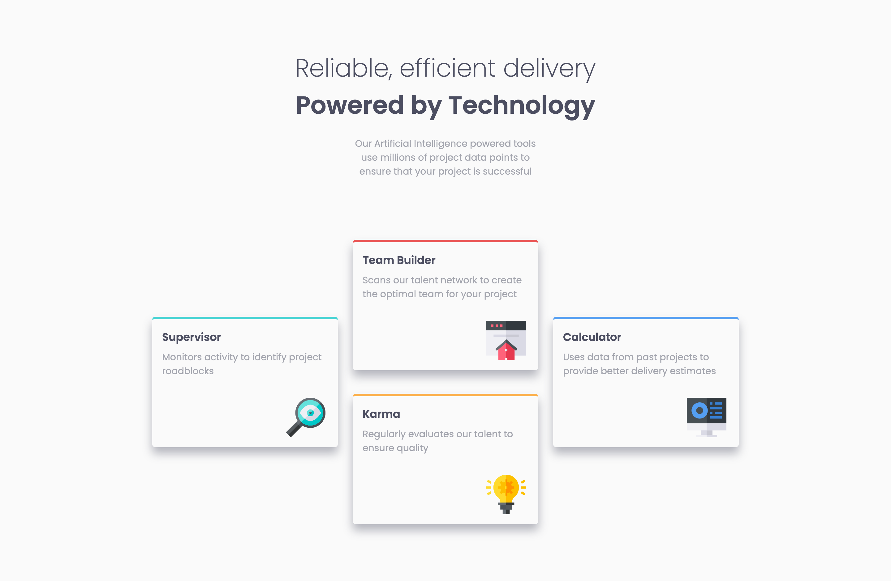
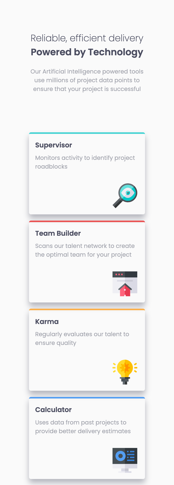

# Frontend Mentor - Four card feature section solution

This is a solution to the [Four card feature section challenge on Frontend Mentor](https://www.frontendmentor.io/challenges/four-card-feature-section-weK1eFYK). Frontend Mentor challenges help you improve your coding skills by building realistic projects. 

## Table of contents

- [Overview](#overview)
  - [The challenge](#the-challenge)
  - [Screenshot](#screenshot)
  - [Links](#links)
- [My process](#my-process)
  - [Built with](#built-with)
  - [What I learned](#what-i-learned)
- [Author](#author)

## Overview

### The challenge

Users should be able to:
- View the optimal layout for the site depending on their device's screen size

### Screenshot




### Links

- Solution URL: [GitHub URL](https://devhnry.github.com/four-card-feature-section/)
- Live Site URL: [GitHub Pages URL](https://devhnry.github.io/four-card-feature-section/)

## My process

### Built with

- HTML5
- CSS custom properties
- CSS Grid
- Mobile-First-WorkFlow
- [Vite](https://reactjs.org/) - Frontend-Tool
- [Josh Comeau](https://www.joshwcomeau.com/css/custom-css-reset/) - For Reset styles

**Note: These are just examples. Delete this note and replace the list above with your own choices**

### What I learned
This project really helped me move out of my comfort zone and further helped me to understand the CSS Grid Layout more.
Code snippets, see below:

```css
@media(min-width: 60rem){
  .container{
    display: grid;
    gap: 1.5rem;
    grid-template-columns: repeat(3, 300px);
    grid-template-rows:  repeat(2, 225px);
    align-items: center;
  }
}
```

## Author
- Frontend Mentor - [@devhnry](https://www.frontendmentor.io/profile/devhnry)
